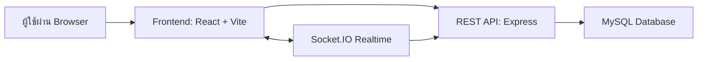
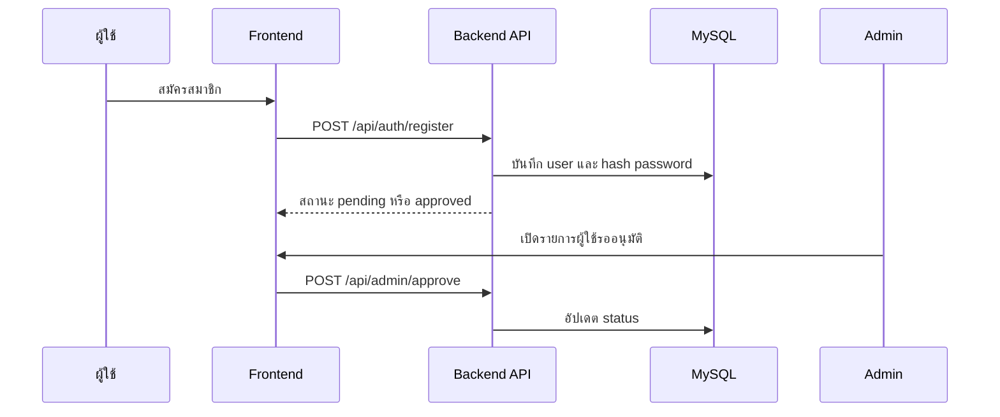
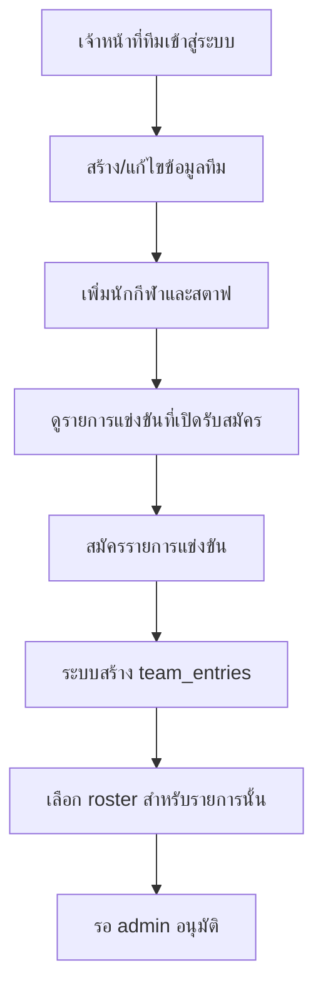
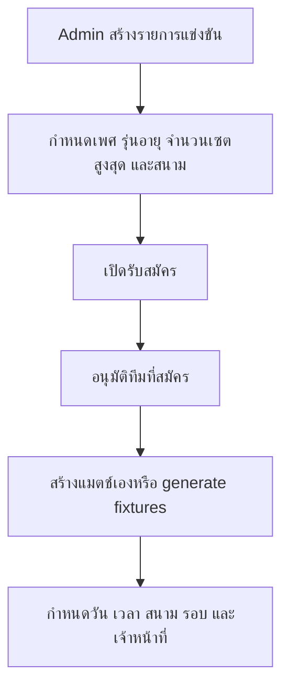
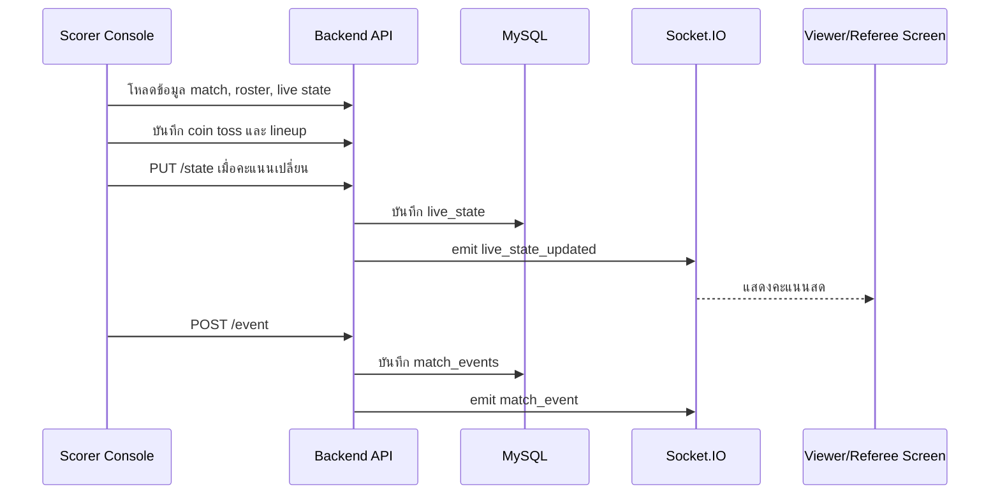

# โครงการระบบจัดการแข่งขันวอลเลย์บอลและบันทึกคะแนนอิเล็กทรอนิกส์

## 1. ชื่อโครงการ

ระบบจัดการแข่งขันวอลเลย์บอลและบันทึกคะแนนอิเล็กทรอนิกส์  
Volleyball Tournament Management and Electronic Score System

## 2. ความเป็นมาและความสำคัญ

การจัดการแข่งขันวอลเลย์บอลมีข้อมูลหลายส่วนที่ต้องประสานกัน เช่น รายการแข่ง ทีม นักกีฬา เจ้าหน้าที่ สนาม ตารางการแข่งขัน รายชื่อผู้เล่นในแต่ละแมตช์ ผลการแข่งขัน และสถิติรายบุคคล หากจัดการด้วยเอกสารกระดาษหรือไฟล์แยกกัน อาจเกิดความซ้ำซ้อน ตรวจสอบยาก และใช้เวลามากเมื่อต้องเผยแพร่ผลการแข่งขันแบบทันที

ระบบนี้จึงถูกพัฒนาเป็นเว็บแอปพลิเคชันแบบ Full-stack เพื่อช่วยให้ผู้ดูแลการแข่งขันสามารถสร้างและบริหารรายการแข่งได้ครบวงจร ทีมสามารถลงทะเบียนและจัดการข้อมูลตนเองได้ ส่วนเจ้าหน้าที่บันทึกคะแนนสามารถควบคุมคะแนนสด บันทึกเหตุการณ์ในสนาม และส่งข้อมูลไปยังหน้าผู้ชมแบบเรียลไทม์

## 3. วัตถุประสงค์

1. เพื่อพัฒนาระบบกลางสำหรับจัดการรายการแข่งขันวอลเลย์บอล
2. เพื่อให้ทีมสามารถสมัครเข้าร่วมรายการแข่งขันและจัดการรายชื่อนักกีฬา/สตาฟได้
3. เพื่อให้ผู้ดูแลระบบอนุมัติทีม จัดตารางแข่งขัน กำหนดสนาม และกำหนดเจ้าหน้าที่ได้
4. เพื่อให้เจ้าหน้าที่บันทึกคะแนนสามารถบันทึกคะแนน เหตุการณ์ รายชื่อตัวจริง ตัวสำรอง ลิเบอโร การเปลี่ยนตัว การขอเวลานอก และการลงโทษได้
5. เพื่อแสดงคะแนนสด ตารางการแข่งขัน รายชื่อทีม อันดับ และสถิติต่อผู้ชมทั่วไป
6. เพื่อจัดเก็บข้อมูลการแข่งขันในฐานข้อมูล MySQL อย่างเป็นระบบและเรียกดูย้อนหลังได้

## 4. ขอบเขตของระบบ

ระบบครอบคลุมงานหลักดังนี้

- การสมัครสมาชิกและเข้าสู่ระบบ
- การแบ่งสิทธิ์ผู้ใช้งานตามบทบาท
- การจัดการทีม นักกีฬา และสตาฟ
- การจัดการรายการแข่งขันตามเพศและรุ่นอายุ
- การสมัครเข้าร่วมรายการแข่งขัน
- การอนุมัติบัญชีผู้ใช้และรายการสมัครทีม
- การจัดการสนามแข่งขัน
- การจัดการเจ้าหน้าที่ ได้แก่ กรรมการ ผู้บันทึกคะแนน และไลน์จजด์
- การสร้างและแก้ไขแมตช์แข่งขัน
- การสร้างตารางแข่งแบบ Round Robin
- การบันทึกคะแนนสดผ่าน Scorer Console
- การบันทึก lineup, coin toss, set, match event, timeout, substitution, sanction และ challenge
- การแสดงคะแนนสดสำหรับผู้ตัดสินและผู้ชม
- การสร้างข้อมูลสำหรับ scoresheet และ roster verification
- การแสดงข้อมูลสาธารณะ เช่น ทีม ตารางแข่ง ผลการแข่งขัน อันดับ และสถิติ

## 5. ผู้ใช้งานระบบ

### 5.1 ผู้ดูแลระบบ

ผู้ดูแลระบบมีสิทธิ์จัดการข้อมูลหลักทั้งหมด เช่น บัญชีผู้ใช้ ทีม รายการแข่งขัน สนาม เจ้าหน้าที่ และแมตช์แข่งขัน รวมถึงอนุมัติผู้ใช้หรือทีมที่รอตรวจสอบ

### 5.2 เจ้าหน้าที่ทีม

เจ้าหน้าที่ทีมสามารถสร้างหรือแก้ไขข้อมูลทีม เพิ่มนักกีฬา เพิ่มสตาฟ เลือกรายการแข่งที่เปิดรับสมัคร และกำหนดรายชื่อนักกีฬาในแต่ละรายการแข่งขันได้

### 5.3 เจ้าหน้าที่บันทึกคะแนน

เจ้าหน้าที่บันทึกคะแนนเข้าใช้งานหน้าควบคุมการแข่งขัน เพื่อเตรียมข้อมูลก่อนแข่ง บันทึกคะแนนสด บันทึกเหตุการณ์ระหว่างแข่งขัน จบเซต และจบแมตช์

### 5.4 ผู้ชมทั่วไป

ผู้ชมทั่วไปไม่ต้องเข้าสู่ระบบ สามารถดูหน้าหลัก รายชื่อทีม ตารางแข่งขัน คะแนนสด ผลการแข่งขัน อันดับ และสถิติผู้เล่นได้

## 6. สถาปัตยกรรมของระบบ

ระบบแบ่งเป็น 3 ส่วนหลัก



### 6.1 Frontend

Frontend อยู่ในโฟลเดอร์ `client/` พัฒนาด้วย React, Vite และ Tailwind CSS ใช้ React Router สำหรับการนำทาง และ Axios สำหรับเชื่อมต่อ API

เทคโนโลยีสำคัญ:

- React 19
- Vite 7
- React Router DOM
- Axios
- Socket.IO Client
- Tailwind CSS
- SweetAlert2
- PDF libraries เช่น `pdf-lib`, `jspdf`, `@react-pdf/renderer`
- Lucide React สำหรับ icon

### 6.2 Backend

Backend อยู่ในโฟลเดอร์ `backend/` พัฒนาด้วย Express และเชื่อมต่อ MySQL ผ่าน `mysql2/promise`

เทคโนโลยีสำคัญ:

- Express
- MySQL2
- JSON Web Token
- bcryptjs
- Socket.IO
- CORS
- dotenv
- cookie-parser

### 6.3 Database

ฐานข้อมูลใช้ MySQL โดยมี migration อยู่ที่ `backend/migrations/` ใช้เก็บข้อมูลผู้ใช้ ทีม นักกีฬา รายการแข่ง ตารางแข่ง แมตช์ คะแนน เหตุการณ์ รายชื่อผู้เล่น เจ้าหน้าที่ และสถานะต่าง ๆ

## 7. โครงสร้างไฟล์สำคัญ

```text
volley/
  client/
    src/
      App.jsx
      api.js
      pages/
      components/
      context/
      utils/
    public/
      templates/
      assets/
  backend/
    server.js
    config/
      db.js
    middleware/
      authMiddleware.js
    routes/
      api.js
      adminRoutes.js
      scorerRoutes.js
      officialRoutes.js
    controllers/
      authController.js
      teamController.js
      competitionsController.js
      matchController.js
      scorerController.js
      publicController.js
      officialController.js
      stadiumsController.js
      playerController.js
      adminController.js
    migrations/
```

## 8. โมดูล Frontend

### 8.1 Routing

ไฟล์ `client/src/App.jsx` กำหนดเส้นทางหลักของเว็บ เช่น

- `/` หน้าแรกสำหรับผู้ชมทั่วไป
- `/login` เข้าสู่ระบบ
- `/register` สมัครสมาชิก
- `/admin` แผงควบคุมผู้ดูแลระบบ
- `/team-dashboard` หน้าจัดการทีม
- `/create-team` สร้างทีม
- `/adminscorer` หน้ารวมสำหรับผู้บันทึกคะแนน
- `/scorer/:matchId` หน้าควบคุมคะแนนสด
- `/staff/:matchId` หน้าสำหรับเจ้าหน้าที่ทีมในแมตช์
- `/match/:matchId/referee` หน้าดูคะแนนสำหรับผู้ตัดสิน
- `/match/:matchId/viewer` หน้าดูคะแนนสำหรับผู้ชม
- `/scoresheet/:matchId` หน้าข้อมูล scoresheet
- `/roster-verification/:matchId` ตรวจสอบ roster
- `/matches`, `/teams`, `/standings`, `/stats` หน้าสาธารณะ

### 8.2 API Client

ไฟล์ `client/src/api.js` เป็นศูนย์กลางสำหรับเรียก Backend API โดยตั้งค่า `BASE_URL` จาก `VITE_API_URL` และแนบ JWT token จาก `localStorage` ใน header `Authorization`

หน้าที่หลัก:

- เรียก API สมัคร/เข้าสู่ระบบ
- เรียก API จัดการทีมและนักกีฬา
- เรียก API จัดการรายการแข่งและแมตช์
- เรียก API scorer
- เรียก API officials
- แปลง URL รูปภาพจาก localhost ไปยัง production backend เมื่อจำเป็น

### 8.3 หน้า Admin

หน้าผู้ดูแลระบบประกอบด้วยแท็บสำคัญ เช่น

- `AdminDashboard.jsx`: หน้า dashboard หลักของผู้ดูแล
- `PendingUsersTab.jsx`: อนุมัติหรือปฏิเสธผู้ใช้ใหม่
- `AccountsTab.jsx`: จัดการบัญชีผู้ใช้
- `ClubsTab.jsx`: จัดการทีมและข้อมูลสโมสร
- `CompetitionsTab.jsx`: จัดการรายการแข่งขัน
- `MatchManagementTab.jsx`: จัดการแมตช์
- `StadiumsTab.jsx`: จัดการสนาม
- `OfficialsTab.jsx`: จัดการกรรมการ ผู้บันทึกคะแนน และไลน์จजด์
- `TeamRankingTab.jsx`: คำนวณและแสดงอันดับทีม

### 8.4 หน้า Team Dashboard

`TeamDashboard.jsx` ใช้สำหรับเจ้าหน้าที่ทีม โดยรองรับงานต่อไปนี้

- ดูและแก้ไขข้อมูลทีม
- อัปโหลดโลโก้ทีม
- กำหนดสีชุดแข่งขันและสีชุดลิเบอโร
- เพิ่ม แก้ไข ลบนักกีฬา
- ระบุหมายเลข ตำแหน่ง เพศ ส่วนสูง น้ำหนัก วันเกิด รูปภาพ และสถานะการลงแข่ง
- ระบุกัปตัน ลิเบอโร 1 และลิเบอโร 2
- เพิ่ม แก้ไข ลบสตาฟทีม
- สมัครหรือถอนตัวจากรายการแข่งขันที่เปิดรับสมัคร
- เลือก roster สำหรับรายการแข่งขันแต่ละรายการ
- ดูตารางการแข่งขันของทีม
- ดูสถิติผู้เล่นและส่งออก CSV

### 8.5 หน้า Scorer และ Live Match

ส่วน Scorer อยู่ใน `client/src/components/scorer/` และ `client/src/pages/LiveMatchScorer.jsx`

ฟังก์ชันหลัก:

- เลือกแมตช์ที่จะบันทึกคะแนน
- ตั้งค่าก่อนแข่ง เช่น coin toss, ฝั่งสนาม, ทีมเสิร์ฟก่อน และเจ้าหน้าที่
- จัด lineup ตัวจริง 6 ตำแหน่งและลิเบอโร
- บันทึกคะแนนราย rally
- หมุนตำแหน่งอัตโนมัติเมื่อทีมรับเสิร์ฟได้แต้ม
- จัดการ timeout, substitution, libero swap, sanction, injury, protest และ challenge
- undo เหตุการณ์
- จบเซตและเริ่มเซตถัดไป
- จบแมตช์และบันทึกผู้ชนะ
- ส่งสถานะสดผ่าน Socket.IO

### 8.6 หน้าสาธารณะ

หน้าสาธารณะอยู่ใน `client/src/pages/guest/`

- `LandingPage.jsx`: หน้าแรก
- `PublicMatches.jsx`: ตารางแข่งและผลการแข่งขัน
- `PublicTeams.jsx`: รายชื่อทีมและนักกีฬา
- `PublicStandings.jsx`: ตารางคะแนน
- `PublicStatistics.jsx`: สถิติผู้เล่น
- `MatchCentrePage.jsx`: ศูนย์ข้อมูลแมตช์

## 9. โมดูล Backend

### 9.1 Server

ไฟล์ `backend/server.js` ทำหน้าที่

- โหลด environment variables จาก `backend/.env`
- เปิด Express server
- ตั้งค่า CORS และ parser สำหรับ JSON/form data
- ให้บริการไฟล์ static จาก `/uploads`
- ผูก route หลัก ได้แก่ `/api`, `/api/scorer`, `/api/admin`
- เปิด Socket.IO เพื่อส่งสถานะการแข่งขันแบบเรียลไทม์
- หาก port ที่กำหนดถูกใช้อยู่ ระบบจะลองใช้ port ถัดไป

### 9.2 Authentication Middleware

ไฟล์ `backend/middleware/authMiddleware.js`

- `verifyToken`: ตรวจสอบ JWT จาก `Authorization: Bearer <token>`
- `isAdmin`: อนุญาตเฉพาะ role `admin`
- `hasAnyRole`: ตรวจสอบหลาย role
- `isScorerOrAdmin`: อนุญาต role `admin`, `score`, `scorer`

### 9.3 Database Wrapper

ไฟล์ `backend/config/db.js`

- สร้าง MySQL connection pool
- ใช้ charset `utf8mb4`
- รองรับ SSL
- มี wrapper แปลง SQL บางรูปแบบจาก PostgreSQL-style เป็น MySQL เช่น `$1` เป็น `?`, `RETURNING`, `NOW()`, `ILIKE`
- คืนผลลัพธ์ในรูปแบบที่ใช้งานคล้าย `rows`, `rowCount`, `insertId`, `affectedRows`

## 10. API หลักของระบบ

### 10.1 Public API

ไม่ต้องเข้าสู่ระบบ

- `POST /api/auth/register`: สมัครสมาชิก
- `POST /api/auth/login`: เข้าสู่ระบบ
- `POST /api/auth/logout`: ออกจากระบบ
- `GET /api/age-groups`: ดูรุ่นอายุ
- `GET /api/competitions/open`: ดูรายการแข่งขันที่เปิดรับสมัคร
- `GET /api/public/competitions`: ดูรายการแข่งขันทั้งหมดสำหรับสาธารณะ
- `GET /api/public/teams`: ดูทีมทั้งหมด
- `GET /api/public/competitions/:competitionId/teams`: ดูทีมในรายการแข่งขัน
- `GET /api/public/teams/:teamId/players`: ดูนักกีฬาในทีม
- `GET /api/public/teams/:teamId/staff`: ดูสตาฟในทีม
- `GET /api/public/matches`: ดูแมตช์และผลการแข่งขัน
- `GET /api/public/statistics/:competitionId`: ดูสถิติผู้เล่น

### 10.2 Team API

ต้องเข้าสู่ระบบ

- `GET /api/my-team`: ดูทีมปัจจุบัน
- `GET /api/my-teams`: ดูทีมทั้งหมดของผู้ใช้
- `POST /api/my-team/create`: สร้างทีม
- `POST /api/my-team/:id/switch`: สลับทีม active
- `PUT /api/my-team`: แก้ไขทีม
- `DELETE /api/my-team`: ลบทีม
- `GET /api/my-team/players`: ดูนักกีฬาในทีม
- `POST /api/my-team/players`: เพิ่มนักกีฬา
- `PUT /api/my-team/players/:id`: แก้ไขนักกีฬา
- `DELETE /api/my-team/players/:id`: ลบนักกีฬา
- `GET /api/my-team/staff`: ดูสตาฟ
- `POST /api/my-team/staff`: เพิ่มสตาฟ
- `PUT /api/my-team/staff/:id`: แก้ไขสตาฟ
- `DELETE /api/my-team/staff/:id`: ลบสตาฟ
- `GET /api/my-team/competitions`: ดูรายการที่ทีมสมัคร
- `GET /api/my-team/entries`: ดูรายการสมัครแบบ team entry
- `GET /api/my-team/entries/:entryId/players`: ดู roster ของรายการสมัคร
- `PUT /api/my-team/entries/:entryId/players`: อัปเดต roster
- `POST /api/competitions/join`: สมัครเข้าร่วมรายการแข่ง
- `POST /api/competitions/leave`: ถอนตัวจากรายการแข่ง
- `GET /api/my-team/matches`: ดูแมตช์ของทีม
- `GET /api/my-team/matches/:gender`: ดูแมตช์ของทีมตามเพศ

### 10.3 Admin API

ต้องเข้าสู่ระบบและเป็น `admin`

- `GET /api/admin/pending-users`: ดูผู้ใช้รออนุมัติ
- `POST /api/admin/approve`: อนุมัติหรือปฏิเสธผู้ใช้
- `GET /api/admin/users`: ดูผู้ใช้ทั้งหมด
- `PUT /api/admin/users/:id`: แก้ไขผู้ใช้
- `DELETE /api/admin/users/:id`: ลบผู้ใช้
- `GET /api/admin/teams`: ดูทีมทั้งหมด
- `POST /api/admin/teams`: สร้างทีม
- `PUT /api/admin/teams/:id`: แก้ไขทีม
- `DELETE /api/admin/teams/:id`: ลบทีม
- `GET /api/admin/team-entries`: ดูรายการสมัครของทีม
- `PATCH /api/admin/team-entries/:entryId/status`: อนุมัติหรือเปลี่ยนสถานะทีมในรายการแข่ง
- `GET /api/admin/competitions`: ดูรายการแข่งขัน
- `POST /api/admin/competitions`: สร้างรายการแข่งขัน
- `PUT /api/admin/competitions/:id`: แก้ไขรายการแข่งขัน
- `DELETE /api/admin/competitions/:id`: ลบรายการแข่งขัน
- `PATCH /api/admin/competitions/:id/status`: เปิด/ปิดรายการแข่งขัน
- `GET /api/admin/matches/all`: ดูแมตช์ทั้งหมด
- `POST /api/matches`: สร้างแมตช์
- `PUT /api/matches/:id`: แก้ไขแมตช์
- `DELETE /api/matches/:id`: ลบแมตช์
- `PUT /api/matches/:id/result`: อัปเดตผลการแข่งขัน
- `POST /api/competitions/:competitionId/generate-matches`: สร้าง fixture แบบ Round Robin
- `GET /api/admin/stadiums`: ดูสนาม
- `POST /api/admin/stadiums`: เพิ่มสนาม
- `PUT /api/admin/stadiums/:id`: แก้ไขสนาม
- `DELETE /api/admin/stadiums/:id`: ลบสนาม

### 10.4 Scorer API

มีทั้ง endpoint อ่านแบบสาธารณะ และ endpoint เขียนที่ต้องเป็น admin/scorer

- `GET /api/scorer/match/:matchId`: ดูรายละเอียดแมตช์
- `GET /api/scorer/match/:matchId/events`: ดูเหตุการณ์ในแมตช์
- `GET /api/scorer/match/:matchId/lineup`: ดู lineup
- `GET /api/scorer/match/:matchId/roster`: ดูข้อมูล roster สำหรับ PDF/verification
- `GET /api/scorer/match/:matchId/scoresheet`: ดูข้อมูล scoresheet
- `GET /api/scorer/match/:matchId/state`: ดู live state
- `POST /api/scorer/match/:matchId/event`: บันทึก event
- `POST /api/scorer/match/:matchId/toss`: บันทึก coin toss
- `POST /api/scorer/match/:matchId/lineup`: บันทึก lineup
- `POST /api/scorer/match/:matchId/start-set`: เริ่มเซต
- `POST /api/scorer/match/:matchId/end-set`: จบเซต
- `PUT /api/scorer/match/:matchId/state`: อัปเดต live state
- `PUT /api/scorer/match/:matchId/officials`: อัปเดตเจ้าหน้าที่ประจำแมตช์
- `PUT /api/scorer/match/:matchId/roster`: อัปเดต roster ของแมตช์
- `POST /api/scorer/match/:matchId/teams/:teamId/players`: เพิ่มผู้เล่นในบริบทแมตช์
- `PUT /api/scorer/match/:matchId/teams/:teamId/players/:playerId`: แก้ไขผู้เล่นในบริบทแมตช์

### 10.5 Officials API

- `GET /api/admin/referees`, `POST /api/admin/referees`, `PUT /api/admin/referees/:id`, `DELETE /api/admin/referees/:id`
- `GET /api/admin/scorers`, `POST /api/admin/scorers`, `PUT /api/admin/scorers/:id`, `DELETE /api/admin/scorers/:id`
- `GET /api/admin/line-judges`, `POST /api/admin/line-judges`, `PUT /api/admin/line-judges/:id`, `DELETE /api/admin/line-judges/:id`

## 11. โครงสร้างข้อมูลหลัก

### 11.1 users

เก็บบัญชีผู้ใช้

- `id`
- `username`
- `password_hash`
- `role`
- `status`
- `team_id`
- `created_at`
- ข้อมูลเสริมบาง schema อาจมี `email`, `phone`

บทบาทที่พบในระบบ:

- `admin`
- `team_staff`
- `score`
- `scorer`

### 11.2 teams

เก็บข้อมูลทีม/สโมสร

- `id`
- `name`
- `code`
- `logo_url`
- `coach`
- `manager_name`
- `phone`
- `email`
- `province`
- `address`
- `user_id`
- `status`
- `main_color`, `second_color`, `third_color`
- `libero_main_color`, `libero_second_color`, `libero_third_color`

### 11.3 players

เก็บข้อมูลนักกีฬา

- `id`
- `team_id`
- `number`
- `first_name`
- `last_name`
- `nickname`
- `position`
- `height_cm`
- `weight`
- `birth_date`
- `nationality`
- `photo`
- `gender`
- `is_active`
- `is_playing`
- `is_captain`
- `is_libero1`
- `is_libero2`

### 11.4 team_staff

เก็บสตาฟของทีม

- `id`
- `team_id`
- `first_name`
- `last_name`
- `role`
- `gender`

### 11.5 competitions

เก็บรายการแข่งขัน

- `id`
- `title`
- `details`
- `sport`
- `gender`
- `age_group_id`
- `start_date`
- `end_date`
- `location`
- `stadium_id`
- `status`
- `max_sets`
- `max_players`

สถานะของรายการแข่งขันโดยหลักคือ `open` และ `closed`

### 11.6 age_groups

เก็บรุ่นอายุ เช่น

- `U12`
- `U14`
- `U16`
- `U18`
- `Open`

### 11.7 team_entries

เก็บการสมัครทีมเข้ารายการแข่งขันแบบแยกตามรายการ เพศ และรุ่นอายุ

- `id`
- `team_id`
- `competition_id`
- `display_name`
- `gender`
- `age_group_id`
- `status`
- `registered_at`
- `notes`

สถานะที่ใช้ เช่น `pending`, `approved`, `rejected`, `withdrawn`

### 11.8 team_entry_players

เก็บ roster เฉพาะรายการแข่งขันนั้น ๆ

- `team_entry_id`
- `player_id`
- `number`
- `role`
- `is_captain`
- `is_libero1`
- `is_libero2`
- `is_playing`

ตารางนี้ช่วยให้ทีมเดียวกันมีรายชื่อผู้เล่นต่างกันได้ในแต่ละรายการหรือรุ่นอายุ

### 11.9 matches

เก็บข้อมูลแมตช์แข่งขัน

- `id`
- `competition_id`
- `home_team_id`
- `away_team_id`
- `match_number`
- `round_name`
- `pool_name`
- `match_date`
- `start_time`
- `location`
- `stadium_id`
- `court_number`
- `gender`
- `age_group_id`
- `status`
- `home_set_score`
- `away_set_score`
- `set_scores`
- `winner_team_id`
- `live_state`
- `match_state`
- `first_serve_team_id`
- `left_side_team_id`
- official fields เช่น `referee_1_id`, `referee_2_id`, `scorer_id`, `line_judge_1_id`

สถานะของแมตช์ ได้แก่ `scheduled`, `live`, `completed`, `cancelled`

### 11.10 match_sets

เก็บผลรายเซต

- `match_id`
- `set_number`
- `home_score`
- `away_score`
- `duration_minutes`
- `start_time`
- `end_time`

### 11.11 match_events

เก็บเหตุการณ์ในเกมและ workflow

- `match_id`
- `set_id`
- `team_id`
- `player_id`
- `skill`
- `grade`
- `score_home`
- `score_away`
- `server_player_id`
- `start_zone`
- `end_zone`
- `created_at`

ตัวอย่าง event ที่รองรับ เช่น `COIN_TOSS_WINNER`, `FIRST_SERVE`, `SET_START`, `SUBSTITUTION`, `SANCTION`, `POINT`, `ATTACK_POINT`, `BLOCK_POINT`, `SERVE_ACE`

### 11.12 match_lineups

เก็บ lineup ของแต่ละทีมในแต่ละเซต

- `match_id`
- `team_id`
- `set_number`
- `player_id_p1` ถึง `player_id_p6`
- `libero_id`

### 11.13 match_requests

เก็บคำขอจากเจ้าหน้าที่ทีมระหว่างแข่งขัน

- `match_id`
- `team_id`
- `request_type`
- `status`
- `details`
- `created_at`

ใช้กับคำขอเช่น timeout, substitution, challenge และ lineup

### 11.14 referees, scorers, line_judges

เก็บข้อมูลเจ้าหน้าที่การแข่งขัน

- `id`
- `firstname`
- `lastname`
- `country`
- ข้อมูลรหัสหรือรายละเอียดอื่นตาม schema

### 11.15 stadiums

เก็บข้อมูลสนามแข่งขัน

- `id`
- `name`
- `address`
- `status`

## 12. Workflow การทำงานของระบบ

### 12.1 Workflow สมัครสมาชิกและอนุมัติ



คำอธิบาย: ผู้ใช้ทั่วไปที่ไม่ใช่ admin จะมีสถานะเริ่มต้นเป็น `pending` เพื่อให้ผู้ดูแลตรวจสอบก่อนใช้งานเต็มรูปแบบ ส่วน admin ถูกตั้งเป็น `approved`

### 12.2 Workflow จัดการทีมและสมัครแข่งขัน



คำอธิบาย: ระบบแยกข้อมูลนักกีฬาหลักในทีมออกจาก roster ในแต่ละรายการแข่งขัน ทำให้ทีมสามารถเลือกผู้เล่นไม่เหมือนกันในแต่ละเพศ/รุ่นอายุ/รายการได้

### 12.3 Workflow ผู้ดูแลสร้างรายการและแมตช์



คำอธิบาย: การสร้างรายการแข่งขันรองรับการเลือกหลายเพศหรือหลายรุ่นอายุ ระบบจะสร้างรายการแยกเป็นหมวดหมู่เพื่อจัดการทีมและแมตช์ได้ชัดเจน

### 12.4 Workflow บันทึกคะแนนสด



คำอธิบาย: Frontend scorer ถือ state การแข่งขันและส่งขึ้น backend เป็นระยะ เมื่อมีการอัปเดต backend จะ emit ไปยัง room `match_<matchId>` เพื่อให้หน้าผู้ชมและผู้ตัดสินเห็นข้อมูลล่าสุด

### 12.5 Workflow จบเซตและจบแมตช์

1. Scorer กดจบเซตเมื่อคะแนนถึงเงื่อนไข
2. Backend บันทึกข้อมูลลง `match_sets`
3. Backend คำนวณจำนวนเซตที่แต่ละทีมชนะ
4. อัปเดต `matches.home_set_score`, `matches.away_set_score`, `matches.set_scores`
5. ถ้าทีมใดชนะครบตาม `max_sets` ระบบเปลี่ยนสถานะแมตช์เป็น `completed`
6. บันทึก `winner_team_id`
7. ส่ง `match_updated` ผ่าน Socket.IO

## 13. กติกาและตรรกะสำคัญ

### 13.1 การแบ่งรายการแข่งขัน

รายการแข่งขันผูกกับ `gender` และ `age_group_id` ทำให้รายการเดียวกันสามารถแยกเป็นชาย/หญิง/ผสม และแยกตามรุ่นอายุได้

### 13.2 การสมัครทีม

เมื่อทีมสมัครรายการ ระบบจะสร้างข้อมูลใน `team_entries` และ mirror บางส่วนไว้ใน `team_competitions` เพื่อให้หน้าจอหรือ logic เดิมยังทำงานได้

### 13.3 การตรวจสอบทีมก่อนสร้างแมตช์

ก่อนสร้างแมตช์ ระบบตรวจสอบว่า

- ทีมเหย้าและทีมเยือนต้องไม่ใช่ทีมเดียวกัน
- ทั้งสองทีมต้องสมัครและได้รับอนุมัติในรายการแข่งขันนั้น
- เพศและรุ่นอายุของแมตช์ต้องตรงกับรายการแข่งขัน

### 13.4 การกำหนด roster

ระบบตรวจสอบ roster ว่า

- ผู้เล่นต้องอยู่ในทีมเดียวกัน
- ผู้เล่นต้องตรงกับเพศของรายการแข่งขัน ยกเว้นรายการ mixed/all
- จำนวนผู้เล่นต้องไม่เกิน `max_players`
- หมายเลขผู้เล่นใน roster เดียวกันต้องไม่ซ้ำ

### 13.5 การนับผลการแข่งขัน

ระบบบันทึกคะแนนรายเซตใน `match_sets` และคำนวณเซตที่ชนะจากคะแนนแต่ละเซต เมื่อชนะครบ `ceil(max_sets / 2)` จะถือว่าชนะ match

ตัวอย่าง:

- `max_sets = 3` ต้องชนะ 2 เซต
- `max_sets = 5` ต้องชนะ 3 เซต

## 14. Realtime ด้วย Socket.IO

Socket.IO ใช้ห้องตามแมตช์ในรูปแบบ `match_<matchId>`

Event ที่ใช้หลัก:

- `join_match`: ผู้ใช้เข้าห้องแมตช์ พร้อม role เช่น scorer หรือ staff
- `connection_status_update`: แจ้งสถานะการเชื่อมต่อของ scorer และ staff แต่ละฝั่ง
- `live_state_updated`: แจ้ง state คะแนนสดล่าสุด
- `match_updated`: แจ้งให้ client โหลดข้อมูลแมตช์ใหม่
- `new_staff_request`: แจ้งคำขอจากทีม
- `request_processed`: แจ้งผลอนุมัติ/ปฏิเสธคำขอ
- `request_updated`: แจ้งการเปลี่ยนแปลงคำขอ

## 15. ความปลอดภัย

ระบบใช้มาตรการหลักดังนี้

- เก็บรหัสผ่านแบบ hash ด้วย bcrypt
- ใช้ JWT สำหรับยืนยันตัวตน
- แยกสิทธิ์ด้วย role
- ใช้ middleware ตรวจสอบ token ก่อนเข้าถึง protected routes
- ใช้ parameterized query ในการเข้าถึงฐานข้อมูล
- จำกัดขนาดรูปภาพอัปโหลดที่ 2 MB
- เก็บค่าคอนฟิกฐานข้อมูลและ JWT secret ใน `.env`

ข้อควรปรับปรุงเพิ่มเติม:

- ไม่ควรใช้ค่า default JWT secret ใน production
- ควรจำกัด CORS ตาม domain จริงใน production
- ควรเพิ่ม rate limit สำหรับ login และ upload
- ควรเพิ่ม validation schema สำหรับ request body
- ควรเพิ่ม audit log สำหรับ action สำคัญ เช่น ลบทีม ลบ match หรือแก้ผลการแข่งขัน

## 16. การติดตั้งและรันระบบ

### 16.1 Frontend

```bash
cd client
npm.cmd install
npm.cmd run dev
```

สร้างไฟล์ `client/.env`

```env
VITE_API_URL=http://localhost:3000
```

### 16.2 Backend

```bash
cd backend
npm.cmd install
npm.cmd run dev
```

สร้างไฟล์ `backend/.env`

```env
PORT=3000
DB_HOST=your-host
DB_PORT=3306
DB_USER=your-user
DB_PASSWORD=your-password
DB_NAME=your-database
JWT_SECRET=your-secret
```

## 17. คำสั่งตรวจสอบคุณภาพ

Frontend:

```bash
cd client
npm.cmd run lint
npm.cmd run build
```

Backend:

```bash
cd backend
node --check server.js
```

สำหรับไฟล์ controller หรือ route ที่แก้ไข สามารถใช้ `node --check <file>` เพื่อตรวจ syntax ได้

## 18. Migration ที่มีในระบบ

Migration ปัจจุบันครอบคลุมเรื่องต่อไปนี้

- เพิ่ม unique constraint ให้ lineup และปรับ status enum
- ปรับ timestamp และ foreign key ของ match actions/events/sets/lineups
- เพิ่ม `max_sets` ให้รายการแข่งขัน
- เพิ่ม `team_entries` และ `team_entry_players` เพื่อรองรับการสมัครหลายหมวดหมู่
- เพิ่ม unique constraint หมายเลขผู้เล่นใน roster
- เพิ่ม `gender` และ `age_group_id` ให้ `team_competitions`
- เพิ่ม master data `age_groups`
- ล้างข้อมูลการแข่งขันซ้ำหรือว่าง
- เพิ่ม `country` ให้ line judges
- เพิ่มสีชุดแข่งขันและสีชุด libero
- ขยาย `match_events.skill` ให้รองรับชื่อ workflow event
- ปรับ unique constraint ของ players เพื่อให้รองรับหมายเลขซ้ำข้ามบริบทได้เหมาะสมขึ้น

## 19. ข้อจำกัดปัจจุบัน

- ยังไม่มี test framework แยกเป็นระบบ
- คู่มือเดิมบางไฟล์อาจมีปัญหา encoding เมื่ออ่านผ่าน terminal บางตัว
- Database schema บางส่วนถูกออกแบบให้รองรับ schema เดิมด้วย จึงมี field ที่ซ้ำเชิงแนวคิด เช่น `team_competitions` และ `team_entries`
- Client ใช้ `localStorage` เก็บ token และข้อมูลผู้ใช้
- ยังไม่มีระบบ migration runner อัตโนมัติใน package script

## 20. แนวทางพัฒนาต่อ

1. เพิ่ม test สำหรับ controller สำคัญ เช่น auth, competition, match และ scorer
2. เพิ่ม validation middleware เช่น Joi หรือ Zod
3. เพิ่ม migration runner และ seed script
4. เพิ่มระบบ role permission ให้ละเอียดขึ้น เช่น admin, organizer, scorer, team_staff
5. เพิ่ม audit log สำหรับการแก้ผลการแข่งขันและการลบข้อมูล
6. ปรับ CORS และ JWT secret สำหรับ production
7. เพิ่มระบบ export รายงาน PDF/Excel ให้ครบทุกหน้าที่เกี่ยวข้อง
8. เพิ่ม monitoring สำหรับ Socket.IO connection และ error log
9. ปรับปรุง README ให้สรุปวิธีติดตั้งและ link ไปยังเอกสารฉบับนี้

## 21. สรุป

ระบบนี้เป็นเว็บแอปพลิเคชันสำหรับบริหารการแข่งขันวอลเลย์บอลแบบครบวงจร ตั้งแต่การสมัครทีม การจัดรายการแข่งขัน การจัดแมตช์ การบันทึกคะแนนสด ไปจนถึงการเผยแพร่ข้อมูลให้ผู้ชมทั่วไป จุดแข็งของระบบคือการรวมงานจัดการแข่งขันและงาน scorer ไว้ในระบบเดียว พร้อมรองรับข้อมูลแบบเรียลไทม์ผ่าน Socket.IO และจัดเก็บข้อมูลสำคัญไว้ใน MySQL เพื่อให้ตรวจสอบและเรียกดูย้อนหลังได้
